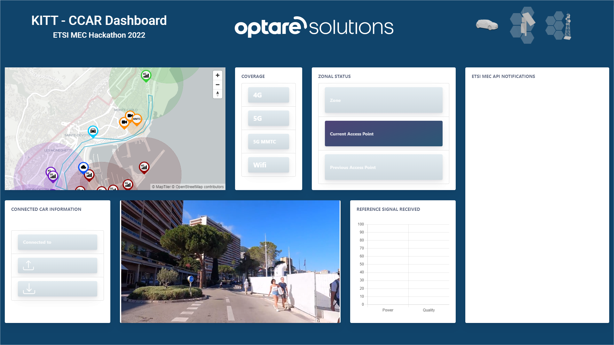
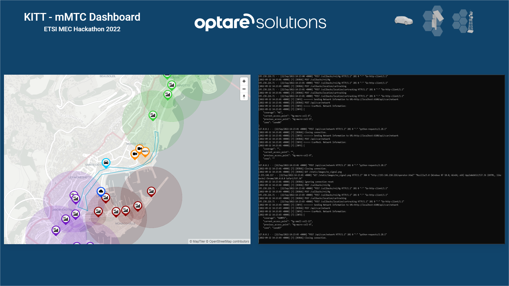
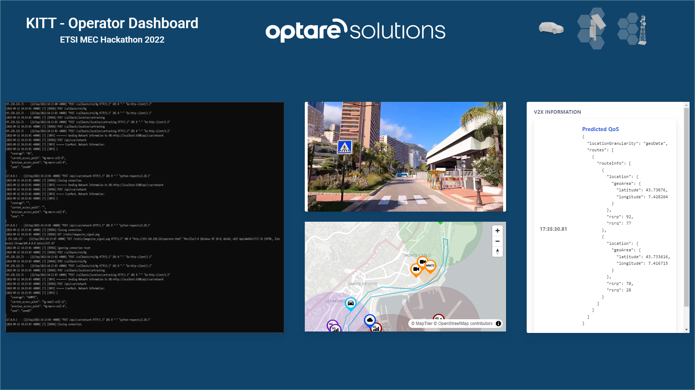
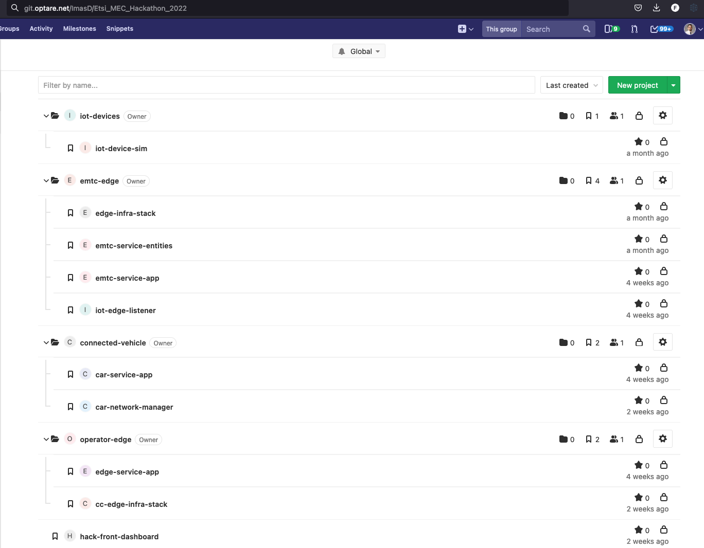

# OPTARE'S TEAM - ETSI MEC Hackathon 2022 - KITT

## Description

This module is a component of the "KITT - Knowledge in the traffic" application that is participating in the ETSI MEC HAckathon 2022.

This element is responsible to consume the Sandbox notifications, retrieve the Edge Services information and communicate it to the Connected Car AI modules. This communication is established via asynchronous REST API mechanisms.

With the information from the AI module, the notifications consumer publishes an information dashboard for monitoring, where the information extracted from the sandbox notifications and the information retrieved from the AI module can be seen.

## Dashboard

The next images are captures from the three dashboards of the project:

### CCar Dashboard



All the Information shown is updated in real time:
- Sandbox Map: the route followed by the connected car.
- Coverage Section: depending on the coverage area where the car is passing through, it shows: 4G, 5G, 5GMMTC, Wifi or No Signal.
- Zonal Status Section: shows the zone information where the car is operating, reflecting the current access point, the previous one, etc.
- Sandbox Notifications: shows the latest types of notifications received from the sandbox and the time they were received.
- Reference Signal: in 4G/5G cases, it shows the reference signal power and quality received in the zone where the car is passing through.
- Video Streaming: It shows the video stream captured by the car  
- Connected Car Information Section: It shows the network which the car is connected to and the tasks performed by the car in every coverage area:
    - Updating SW
    - Retrieving data
    - Uploading data
    - Retrieving SW

### mMTC Dashboard



It shows information about the: 
- Route followed by the connected car
- The mMTC logs

### Edge Operator Dashboard



It shows information about the:
- Operator logs
- AI processed video stream
- Route followed by the connected car
- V2X QoS Requests and the responses

## Tools

In tools is included a bash script and a set of json files to automatize the connected car path creation and the sandbox subscriptions.

```
./create_scenario.sh

This script creates the ETSI MEC Hackathon Scenario

Usage: create_scenario.sh <parameter> <sandbox> <cookie>
 - all: It creates car UE and all subscriptions (location, rni)
 - car: It creates car UE
 - location: It creates the location usertracking subscription
 - rni: It creates all the rni subscriptions
```
## EDGE, MMTC and CAR Service Applications and Infrastructure

The applications that support Edge, MMTC Edge and Car activities for scenarios described in KITT project are, as well as support infrastructure templates and services, structured and uploaded to Optare Solutions Gitlab repository, as you can see in the figure below.



Any question or help related with them can be resolved by the Team.
